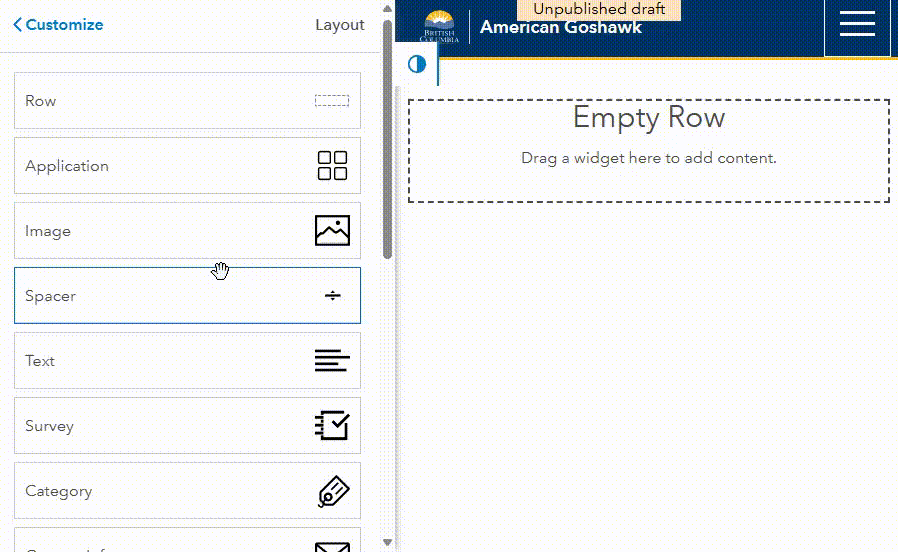
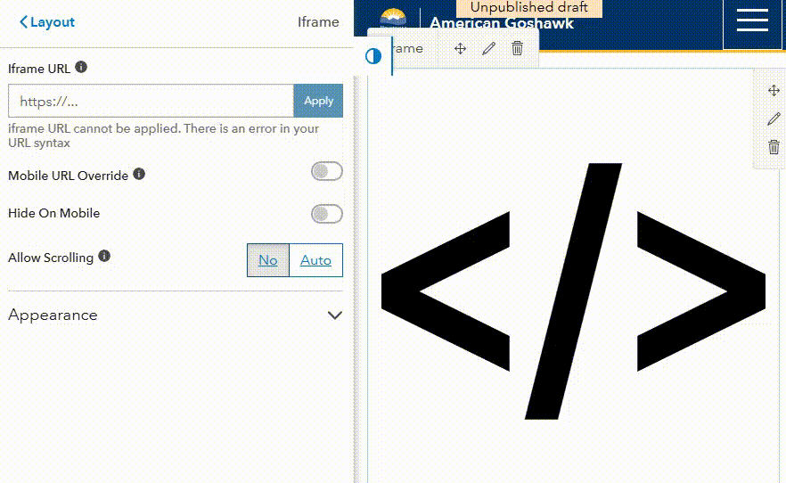
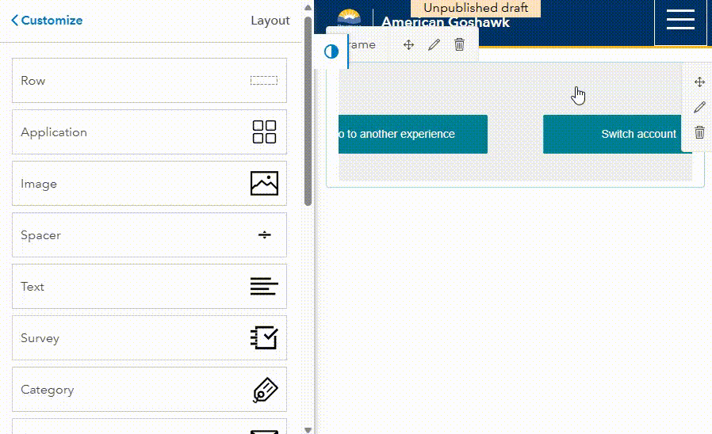
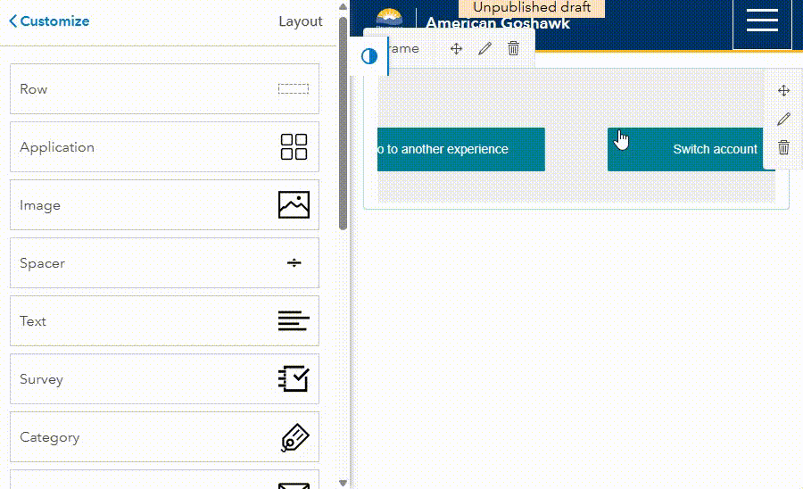

# Fullpage Iframe Settings

### Add an Iframe and a Text Box to your Hub Site:
 *Note*: Insert the Iframe **above** the Text Box

### Add Iframe URL and make sure Iframe Height setting is blank:

### Paste iframe_textbox.html code into Text Box HTML:

### Set Row CSS class to `app-row`

